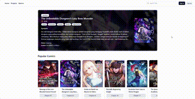

#  Komikrr

> Gabut dikit nyoba sveltekit

## 🚀 Project Overview
Komikr is an web project built to learn Sveltekit, using Shadcn components to create a seamless, stylish comic reading experience. The site use this [API]("https://github.com/Fahridanaa/comic_scraper_api") for scrap the comic data and use cloudinary to store the image

## 📸 Demo

